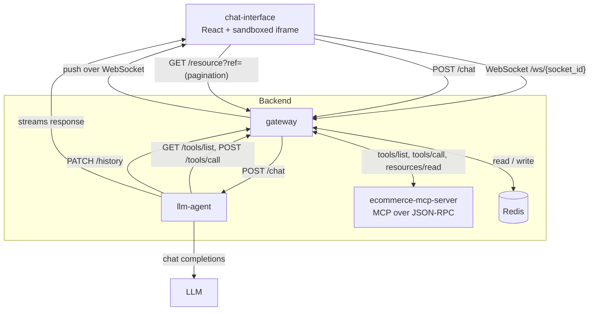
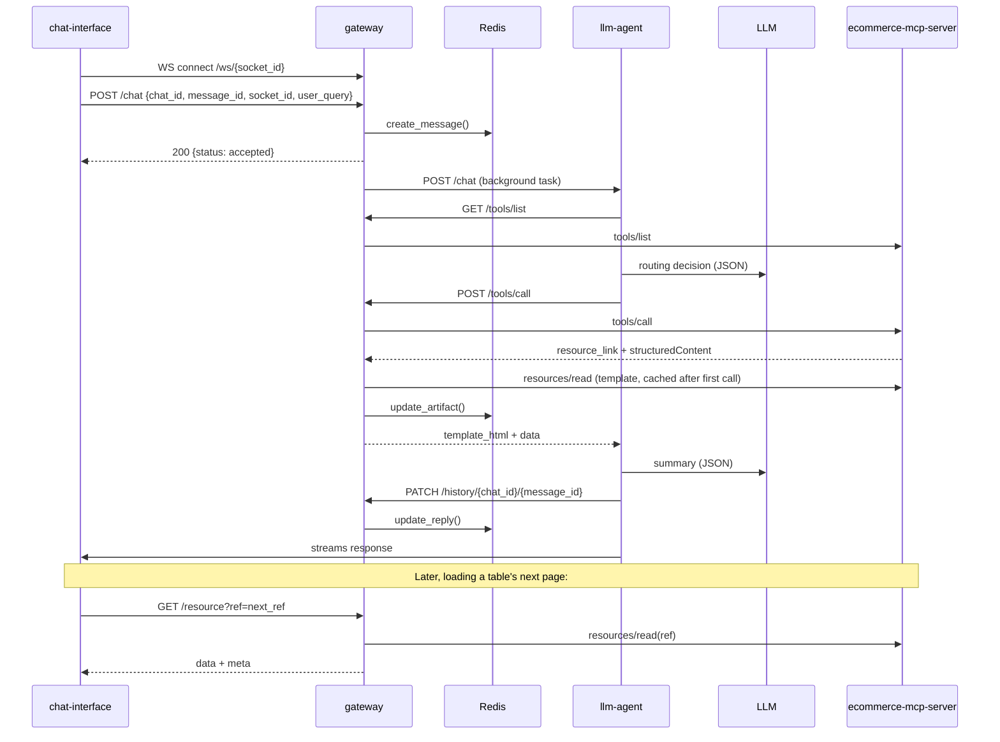

# mcp-shell

**Have you ever wondered how Claude or ChatGPT render a chart or a data table inside the
chat interface, without freezing the UI, without the entire dataset living in the model's
context, and without the artifact breaking when you scroll back through history days later?**

`mcp-shell` is an open-source reference implementation that answers that question end-to-end,
on a real 50,000-row e-commerce dataset, using nothing but the Model Context Protocol, a small
FastAPI gateway, Redis, and a sandboxed iframe.

## The problem

The naive way to build an MCP-connected chat product is to let a tool dump everything into its
response: raw rows, rendered HTML, the whole dataset.

That bloats the LLM's context window and slows the frontend. Worse, it rots. Chat history
re-renders from live data every time, so a chart from last week can silently show different
numbers today. History was never actually frozen.

The root cause is always the same: no separation between what to render and the data being
rendered. Fix that one seam and the rest of these problems disappear.

## The fix, in four moves

1. **Tools never return raw rows.** Every MCP tool returns a `resource_link` (a pointer to a
   template) plus a handful of aggregated numbers. A tool answering "revenue by region" returns
   six totals, not fifty thousand orders.
2. **Templates are real MCP resources**, not files the gateway happens to know about. The chart,
   the table, and the PDF viewer are each fetched via `resources/read`, cached once, and rendered
   inside a sandboxed `<iframe sandbox="allow-scripts">`. No live server, no network access, no
   trust placed in the HTML beyond what the sandbox allows.
3. **Pagination carries no session state.** Loading page two of a table, or the next chunk of a
   report, means resolving a `next_ref` string the server handed back. The same ref works whether
   it's replayed one second or three days later, because there's nothing server-side to expire.
4. **Chat history is a fact, not a query.** Every turn is a single RedisJSON document,
   `chat-history:<chat_id>:<message_id>`, holding the question, the answer, and the artifact that
   was shown, frozen at the moment it was created. Scrolling back never re-runs a tool. It reads
   what actually happened.

## Architecture

Every arrow into `gateway` from the frontend is REST or WebSocket. Every arrow into
`ecommerce-mcp-server` is real MCP (JSON-RPC). The frontend never talks to the MCP server
directly, and `llm-agent` never talks to the MCP server or Redis directly. `gateway` sits in the
middle of every request, and `llm-agent` streams its response straight to the frontend.

## Request flow

